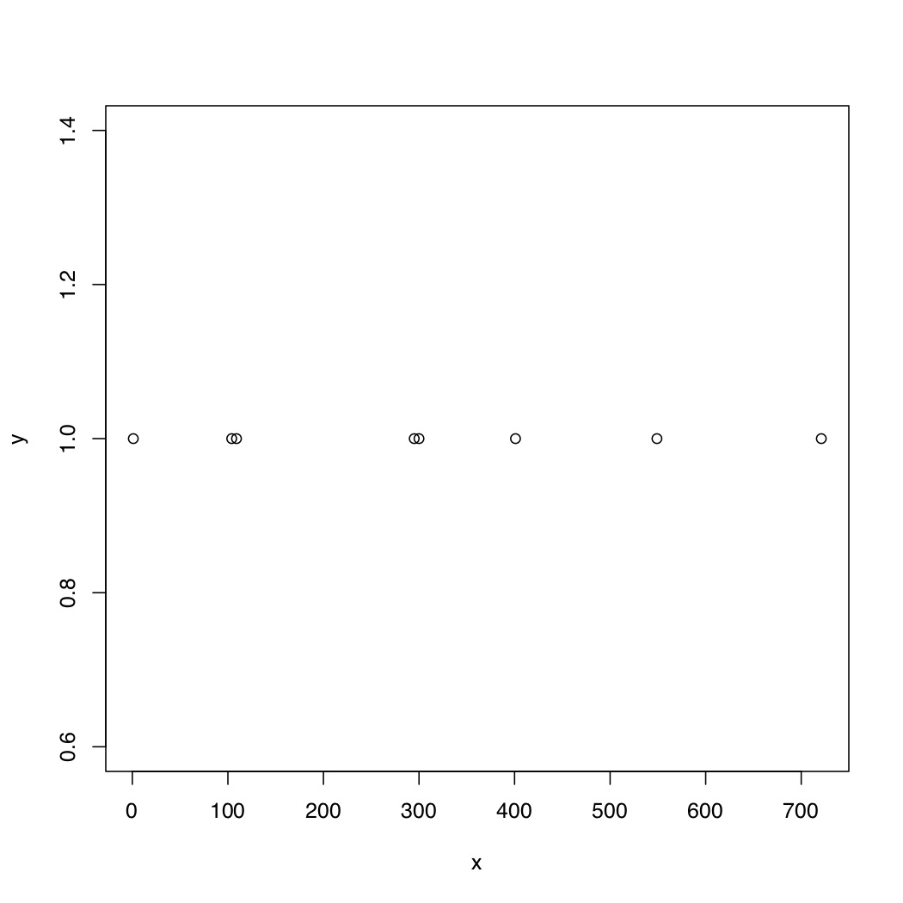

# nonexonmap

## Description

This package plots the position and numbers of non-exon sequences existed in reads in the final transcript sequences assembled by De Novo (fasta file). Furthermore, it can verify if these non-exon sequences are introns.

## Instruction

The \code{exNonexonmap.R} is an example of running the functions in my package. 

In general, there are four functions that could be used by users:
\code{findNonExon.R} will find the location of non-exon sequences on reference sequences and matches & unmatches in reads.
\code{verifyNonExon.R} will verify if the non-exon sequences are introns.
\code{countNonExon.R} is going to count the number of non-exon exists and form data for \code{plotNonExon.R}.

## Example outcome.
```R
exNonexonmap()
``` 
The example outcome is like:


-----------------------------------------------

Some useful keyboard shortcuts for package authoring:

* Build and Reload Package:  `Cmd + Shift + B`
* Update Documentation:      `Cmd + Shift + D` or `devtools::document()`
* Test Package:              `Cmd + Shift + T`
* Check Package:             `Cmd + Shift + E` or `devtools::check()`

-----------------------------------------------


Load the package (outside of this project) with:
    `devtools::install_github("VVVVVan/nonexonmap")`


