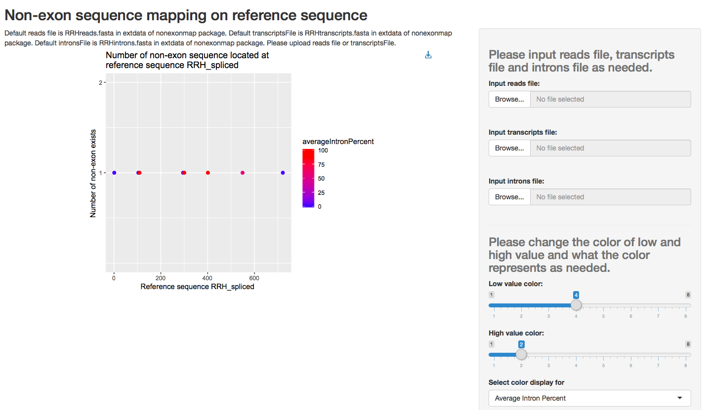

# nonexonmap

## Description

This package plots the position and numbers of non-exon sequences existed in reads file against the final transcript sequence assembled by De Novo (fasta file). Since that the output file is just plain text, the map of reads is an improvement. Furthermore, it can verify if these non-exon sequences are introns and gives the average percentage of introns at each position with an introns file. Shiny app would be created to visulize the plot.

## Instruction

The `mainNonExonMap` is an main function to run the functions in my package. The inputs could be reads file and corresponding transcripts file. Corresponding introns file can also be inputs if you want to verify the non-exon sequences. The output of the function is a data frame with counted number of non-exon at each position on reference sequence and its intron percentage if there is introns file as input. 

The `runNonExonApp` is a function to run the shiny app and plot the data frame created from `mainNonExonMap`.

There are four functions that could not be used by users:
`findNonExon` will find the location of non-exon sequences on reference sequences and matches & unmatches in reads.
`verifyNonExon` will verify if the non-exon sequences are introns.

The `countNonExon` and `countPositionHelp` functions are helper functions for `mainNonExonMap` to count.

## Example outcome.
```R
runNonExonApp()
``` 
The example outcome is like:


You can also change the input files to make different plots, the example input files are listed in ./inst/extdata/testdata.


Not Available Vignette:
    `vignette(package = "nonexonmap")` 
    but a Rmd file is exits in `./vignettes/nonexonmapvignette.Rmd`
    
    
Load the package (outside of this project) with:
    `devtools::install_github("VVVVVan/nonexonmap")`


-----------------------------------------------

Some useful keyboard shortcuts for package authoring:

* Build and Reload Package:  `Cmd + Shift + B`
* Update Documentation:      `Cmd + Shift + D` or `devtools::document()`
* Test Package:              `Cmd + Shift + T`
* Check Package:             `Cmd + Shift + E` or `devtools::check()`

-----------------------------------------------

