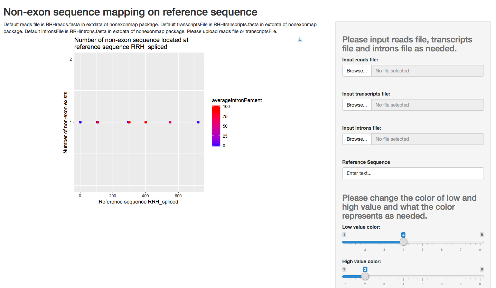
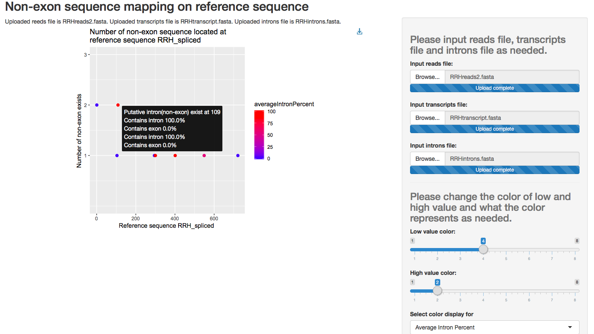

```{r setup, include = FALSE}
knitr::opts_chunk$set(
  collapse = TRUE,
  comment = "#>"
)
```


## Introduction
   From my previous research, I knew that there are non-exon sequences in reads files that is used to assemble transcript sequences in Trinity (a De Novo method). However, the outcomes of Trinity is just plain text in fasta file (Haas, 2013)^[ Haas, BJ. (2013). Trinity-How it Work. https://www.broadinstitute.org/videos/trinity-how-it-works]. Thus, it would be an improvement to map these non-exon seqeunces to assembled transcript sequences and see where they are on a plot.
   
  `nonexonmap` is the package that is going to map the non-exon sequences existed in reads to the final transcript sequences assembled from reads by De Novo, Trinity (Grabherr et al., 2011)^[ Grabherr, MG., Haas, BJ., Yassour, M., Levin, JZ., Thompson, DA., Amit, I., Adiconis, X., Fan, L., Raychowdhury, R., Zeng, Q., Chen, Z., Mauceli, E., Hacohen, N., Gnirke, A., Rhind, N., di Palma, F., Birren, BW., Nusbaum, C., Lindblad-Toh, K., Friedman, N., & Regev, A. (2011). Full-length transcriptome assembly from RNA-seq data without a reference genome. Nat Biotechnol, 29(7), 644-52. doi: 10.1038/nbt.1883.]. 
  
  In `nonexonmap`, `Rsubread` (Liao, Smyth, & Shi, 2013)^[ Liao, Y., Smyth, GK. & Shi, W. (2013). The Subread aligner: fast, accurate
  and scalable read mapping by seed-and-vote. Nucleic Acids Research,
  41(10):e108.] and `Rsamtools` (Morgan et al., 2018)^[ Morgan, M., Pages, H., Obenchain, V. & Hayden, N. (2018). Rsamtools: Binary alignment (BAM), FASTA, variant call (BCF), and tabix file import. R package version 1.34.0. http://bioconductor.org/packages/release/bioc/html/Rsamtools.html] is used to read and align the input fasta file. The functions in the package can analysis the alignment and clearly plot the position of non-exon sequences on the final transcript sequence by `ggplot2` (Wickham, 2016)^[ Wickham, H. (2016). ggplot2: Elegant Graphics for Data Analysis. Springer-Verlag New York.]. Furthermore, if there is introns data for the transcript sequence, it could verify the average percentage of introns in those non-exon sequences at specific position by `ggiraph`, which makes `ggplot2` interactive (Gohel, 2018) ^[ Gohel, D. (2018). ggiraph: Make 'ggplot2' Graphics Interactive. R
  package version 0.6.0. https://davidgohel.github.io/ggiraph]. Also, `shiny` is used to plot and let user interactive with the analysis (Chang et al., 2018)^[ Chang, W., Cheng, J., Allaire, JJ., Xie, Y. & McPherson, J.
  (2018). shiny: Web Application Framework for R. R package version
  1.2.0. https://CRAN.R-project.org/package=shiny].
  
## A quick start for using `nonexonmap` package
  User can download the pacakge outside of project.
```{r, results='hide'}
devtools::install_github("VVVVVan/nonexonmap")
library(nonexonmap)
```
  
  User can use two functions in `nonexonmap` package. One is `runNonExonApp()`, which is used to output the shiny app and the other is `mainNonExonMap()`, which is used to output the counts of non-exon sequences number on transcript seqeunce and the average percentage of introns if there is introns data exists.

### Example usage
```{r, eval=FALSE}
runNonExonApp() # Pop out the shiny page

readsFile <- system.file("extdata/testdata", "RRHreads.fasta", package = "nonexonmap")
transcriptsFile <- system.file("extdata/testdata", "RRHtranscript.fasta", package = "nonexonmap")
intronsFile <- system.file("extdata/testdata", "RRHintrons.fasta", package = "nonexonmap")

mainNonExonMap(readsFile, 
               transcriptsFile) 
# Return the list of counts of number of non-exon exists.

mainNonExonMap(readsFile, 
               transcriptsFile,
               intronsFile)
# Return the list of counts of number of non-exon exists and the average introns percentage.
```

### Example outcomes
#### `runNonExonApp` function
```{r, eval=FALSE}
runNonExonApp() # Pop out the shiny page
```
{width=90%}

#### `mainNonExonMap` function
```{r}
readsFile <- system.file("extdata/testdata", "RRHreads.fasta", package = "nonexonmap")
transcriptsFile <- system.file("extdata/testdata", "RRHtranscript.fasta", package = "nonexonmap")
intronsFile <- system.file("extdata/testdata", "RRHintrons.fasta", package = "nonexonmap")
mainNonExonMap(readsFile, transcriptsFile, intronsFile)
```


## More Directions
### Input for `mainNonExonMap` function
  There are two required input files needed to analysis the data. They are reads file and trancripts file. Both of them should be in FASTA format.
  
  Intron file is an optional input file and should also be in FASTA formta. The intron file is used to analysis if the non-exon sequences exist are introns and how much of them are introns.
  
### Input for shiny app (after run `runNonExonApp`)
  The file inputs is the same as the input for `mainNonExonMap()` function.
  
  Some **default** inputs for shiny app:
  
1. **Input reads file** is `./inst/extdata/testdata/RRH_reads.fasta` in `nonexonmap` package
1. **Input transcripts file** is `./inst/extdata/testdata/RRHtranscripts.fasta` in `nonexonmap` package
1. **Input introns file** is `./inst/extdata/testdata/RRHintrons.fasta` in `nonexonmap` package

### Not exported functions
  There are several functions that could be used by users but are used to process the data.
  
1. `positionNonExon` is the function that use `Rsubread`(Liao, Smyth, & Shi, 2013) to align the input files and `Rsamtools` to read the aligned file (BAM file). 
1. `usePosition` is the factory function for closure to create useful functions `findNonExon` and `verifyNonExon` .
1. `findNonExon` and `verifyNonExon are the functions created from factory function. They are used to read files and align the reads or introns file to transcripts file. The return value of the function is a data frame with all position of alignment, and number of matches and unmatches to the transcripts sequences.
1. `countNonExon` is a function to count the number and record the position of non-exon sequences exist on transcript sequences. It will also count the average percentage of introns in those non-exon sequences at each postion if there is introns file as input.
1. `countPositionHelp` is a helper function for `countNonExon` to count the number of non-exon seqeunces exist on each transcript sequence.

### One more examples
#### Reads with more than one non-exon at one specific position
1. **Input reads file** is `./inst/extdata/testdata/RRH_reads2.fasta` in `nonexonmap` package
1. **Input transcripts file** is `./inst/extdata/testdata/RRHtranscripts.fasta` in `nonexonmap` package
1. **Input introns file** is `./inst/extdata/testdata/RRHintrons.fasta` in `nonexonmap` package
{width=90%}


